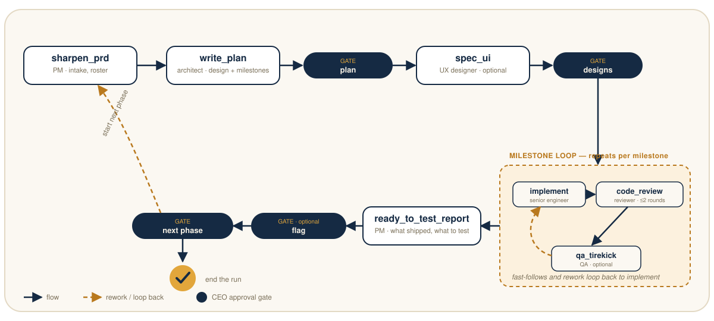

<p align="center"></p>

<p align="center"><i>the <code>sdlc-pipeline</code> Claude Code plugin</i></p>

<p align="center">
  <a href="LICENSE"></a>
  
  
  <a href="CONTRIBUTING.md"></a>
</p>

**You're the CEO.** You write the brief — or just point at a repo with no
brief at all — and Foreman staffs the project for you: a PM, an architect,
a UX designer, a senior engineer, a code reviewer, and a QA engineer, each
a real [Claude Code](https://claude.com/claude-code) subagent with its own
job. They plan, build, review, and test each other's work, and hand off
directly to one another — no CEO sign-off needed between an engineer and
a reviewer, the way it wouldn't be on a real team. You show up at the
handful of points where your judgment actually matters: approving the
plan, the designs, the rollout.

One command runs the whole thing:

```
/sdlc-pipeline start ./my-feature-brief.md
```

It's built as an ordinary Claude Code plugin — a skill that drives the
loop, a slash command that invokes it, six subagents it dispatches.
Nothing here is a separate service or a custom harness; it's prompts and
state files, running on top of Claude Code's own agent and skill
primitives.

## Why this exists

Most "AI does my SDLC" demos either do everything in one giant prompt (so
you can't review any single decision) or stop at the first artifact (a
PRD, a plan) and leave the actual implementation to you. Foreman tries to
sit where a real team would: distinct roles that hand off real artifacts
to each other, a review and QA loop *before* code merges rather than
after, and a small number of approval gates instead of either "ask me
everything" or "ask me nothing."

It's opinionated about a few things:

- 🧑‍🤝‍🧑 **The crew is dynamic.** A tiny bugfix might not need a UX designer
  or even a dedicated QA pass; a big feature might need all six roles. The
  PM proposes who's actually needed for *this* PRD, not a fixed pipeline.
- 🚦 **Gates are macro, not micro.** You approve the plan, the designs,
  and the rollout — not every commit. Review and QA loops between an
  engineer and a reviewer happen without you in the loop, the way they
  would on a real team.
- 📄 **Every approval is something you can actually look at.** The PRD,
  the technical plan, the UX spec, and the readiness report are always
  rendered as a real page (HTML, or a published Claude Artifact when
  available) — never a wall of markdown you're expected to review by
  skimming.
- 💾 **State is a file, not a conversation.** A run's entire status lives
  in a JSON file on disk, so it survives context limits, crashes, and new
  sessions. `resume` picks up a run exactly where it left off, even in a
  brand-new terminal, with a fresh Claude that's never seen the run before.

## Install

**Claude Code** (native, full autonomy — this is the main event):

```
/plugin marketplace add molestreettechllc-dev/sdlc-pipeline
/plugin install sdlc-pipeline
```

(Or clone it and add a local marketplace — see [`.claude-plugin/marketplace.json`](.claude-plugin/marketplace.json)
for the manifest shape if you're developing on it.)

**Other harnesses** (Codex CLI, Cursor, Aider, or anything else that takes
a system prompt): the six role prompts and the orchestrator logic are
plain markdown and JSON, not Claude-Code-locked — but nothing else we know
of has Claude Code's autonomous subagent dispatch built in, so you (or a
script) play the orchestrator by hand, one stage at a time. Full,
honest instructions: [**`docs/other-agents.md`**](docs/other-agents.md).

## Quick start

```
/sdlc-pipeline start ./my-feature-brief.md
```

or, with no brief at all — just an existing codebase:

```
/sdlc-pipeline start https://github.com/you/your-repo
/sdlc-pipeline start /path/to/local/repo
```

That's it. The pipeline runs autonomously from there, printing progress as
it goes, and stops only when it needs you: at a gate, when a rework loop
hits its cap, or when the run completes.

```
/sdlc-pipeline resume <run-id>
/sdlc-pipeline replan <run-id> ["reason"]
```

- **`resume`** continues a paused run — including one you're picking up
  in a fresh session that has no memory of the last one. At a gate, you
  just reply to the question Claude asks, live, the same as any other
  conversation with your agent harness.
- **`replan`** reshapes whatever hasn't happened yet — drop a stage,
  bring back one you'd skipped, swap a role, collapse remaining
  milestones, shrink the rework-round budget. It can't rewrite what's
  already shipped, only what's still ahead.

## What actually happens in a run

<p align="center"></p>

1. **`sharpen_prd`** (PM) — turns a raw brief into a buildable spec, *or*,
   given only a repo with no brief, recons the codebase and drafts a PRD
   from scratch (current-state summary plus a proposed expansion). Also
   proposes the crew: architect and senior engineer are always staffed
   (no plan or code without them), UX designer / code reviewer / QA
   engineer are genuinely optional depending on what the work needs.
2. **`write_plan`** (architect) — a system design and a milestone-by-
   milestone build plan, grounded in what's actually in the repo, never
   invented conventions or dependencies.
3. **`gate_plan`** — you approve the plan, ask for changes, simplify the
   pipeline, or stop.
4. **`spec_ui`** (UX designer, if staffed) — end-to-end user journeys and
   UI mocks, built from the PRD and the plan.
5. **`gate_designs`** — same four options, for the designs.
6. **Milestone loop** — for each milestone, in order:
   - **`implement`** (senior engineer) — breaks it into tickets, builds
     it, writes tests.
   - **`code_review`** (reviewer, if staffed) — read-only; points at
     problems, never fixes them itself. Up to 2 rounds before escalating
     to you.
   - **`qa_tirekick`** (QA engineer, if staffed) — exercises the *running*
     feature, not just the diff; files fast-follow bugs that loop back to
     `implement`.
   - This repeats milestone by milestone with no CEO round-trip in
     between — findings and fast-follow tickets pass directly from one
     role to the next through the run's state and artifacts, the way a
     real crew hands off work without cc'ing the CEO on every comment.
7. **`gate_rollout`** — reached implicitly once every milestone is done.
8. **`ready_to_test_report`** (PM) — a plain readiness report: what
   shipped, what's still behind a flag (see below), what to test.
9. **`gate_flag`** — approve moving behind-flag work to fully on, *if*
   anything's flagged. Skipped by default while a project is still in
   active development (see "Feature flags" below).
10. **`gate_next_phase`** — start another phase (a new PRD/repo feeds a
    fresh run, chained straight from this one) or end the run here.

If a rework loop hits its cap (2 review rounds, or 3 QA rounds by
default) without resolving, that's an escalation, not a silent failure:
you get asked to approve merging anyway, direct one more manual round, or
stop the run.

### The crew

| Role | Stage(s) | What they do |
|---|---|---|
| 📋 **PM** | `sharpen_prd`, `ready_to_test_report` | Turns a raw brief (or a bare repo) into a buildable spec and proposes the crew; later reports plainly on what's ready to test. |
| 🏗️ **Architect** | `write_plan` | System design + milestone plan, grounded in the real repo. Always staffed. |
| 🎨 **UX designer** | `spec_ui` | End-to-end journeys and UI mocks. Optional. |
| 👷 **Senior engineer** | `implement` | Tickets + code + tests, one milestone at a time, and applies fast-follow fixes. Always staffed. |
| 🔍 **Code reviewer** | `code_review` | Read-only review of the diff; never edits code itself. Optional, max 2 rounds per milestone. |
| 🧪 **QA engineer** | `qa_tirekick` | Smoke-tests the running feature end to end; files bugs, doesn't fix them. Optional. |

Each is a plain Claude Code subagent defined in [`agents/`](agents/), with
its own scoped tool access (reviewers and QA are read-only plus Bash for
running things — they can't edit code even by accident).

### Feature flags

`gate_flag` is skipped by default for a project still in active
development (no first production deploy to real users yet) — early on,
flag-gate approvals are just noise. It only runs if you ask for it, at
`start` or at any gate, and a later phase inherits whatever this one
decided unless you say otherwise.

## State and artifacts

Everything about a run lives under `.sdlc/runs/<run-id>/` in the target
project:

```
.sdlc/runs/<run-id>/
  state.json          # the whole run's status — stages, roster, gates, milestones
  artifacts/
    01_sharpen_prd.html
    02_write_plan.html
    03_spec_ui.html
    milestone-1_implement_round1.md
    milestone-1_code_review_round1.md
    milestone-1_qa_tirekick.md
    ...
    05_ready_to_test_report.html
```

`state.json` is the single source of truth — a fresh session can `resume`
a run with zero prior context because everything it needs is on disk, not
in conversation history. The four CEO-facing artifacts (`sharpen_prd`,
`write_plan`, `spec_ui`, `ready_to_test_report`) are always rendered as
real HTML pages, published as a Claude Artifact when that's available in
the session — you're always looking at something, never asked to approve
a summary of a summary.

## Requirements

- [Claude Code](https://claude.com/claude-code) with plugin support, for
  the native experience above. See [`docs/other-agents.md`](docs/other-agents.md)
  for everything else.
- A git repo (or a repo link `start` can check out) for anything past the
  planning stages — the architect, engineer, reviewer, and QA roles all
  read and write real code.

## Status

This is a personal project, shared as-is. It's had real use driving
multi-phase builds end to end, but it's not a polished product — expect
rough edges, and treat the design docs under [`docs/plans/`](docs/plans/)
as the detailed design reference if the skill's own behavior is ever
unclear.

## Contributing

PRs are genuinely welcome — this is a live tool, not a finished one, and
the roles and the orchestrator both improve fastest from real usage
catching real gaps. See [`CONTRIBUTING.md`](CONTRIBUTING.md) for what
makes a good one.

## License

MIT
